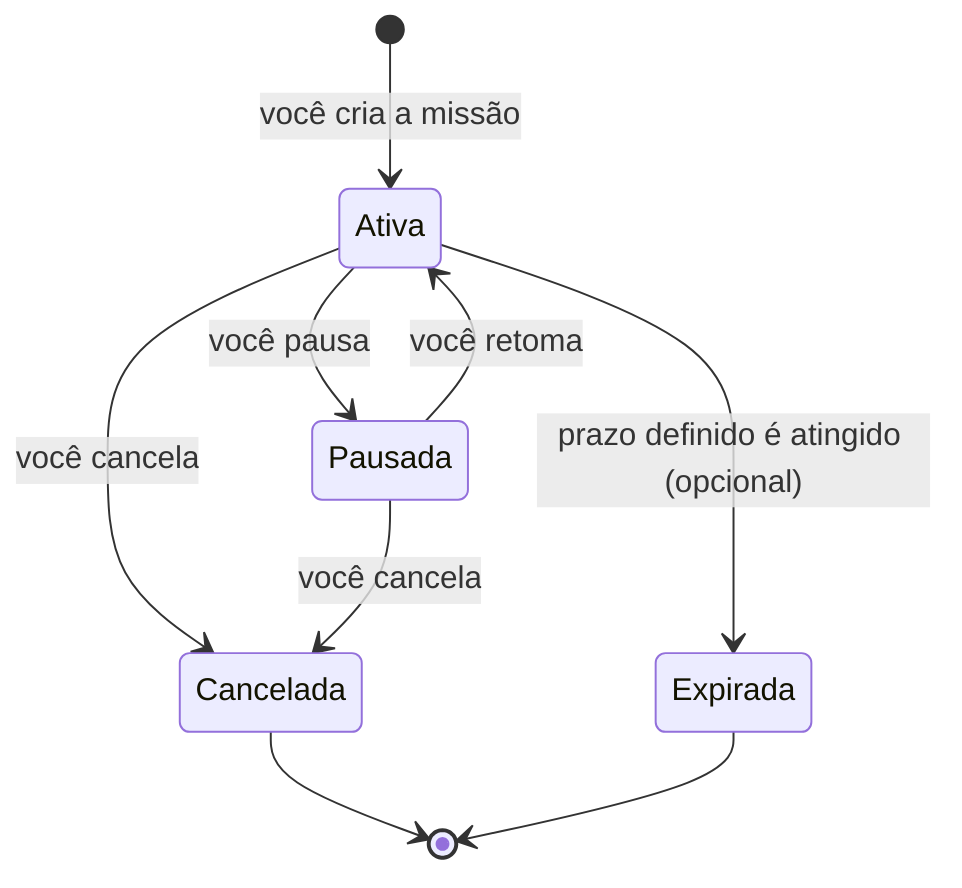

# Missões

Uma **missão** é a forma como o AIShoppingAgent representa "quero acompanhar o preço disto". Ela existe desde o momento em que você descreve o produto até você decidir pausá-la ou cancelá-la.

## Ciclo de vida, do seu ponto de vista

- **Ativa** — está sendo monitorada normalmente; alertas podem ser enviados.
- **Pausada** — o monitoramento para temporariamente, sem perder o histórico já coletado; pode ser retomada a qualquer momento (desde que o prazo, se houver, não tenha sido alcançado).
- **Cancelada** — encerrada por você; não volta a ser monitorada.
- **Expirada** — só acontece quando a missão tem um prazo definido por você; por padrão, uma missão não tem prazo e permanece ativa até você pausar ou cancelar.

## O que compõe uma missão

- **Descrição do produto** — a base da busca, entendida a partir do que você escreveu.
- **Lojas selecionadas** — uma ou várias, entre as [lojas suportadas](lojas.md).
- **Preço-alvo** (opcional) — o valor a partir do qual você quer ser avisado.
- **Preferências de alerta** — queda de preço e/ou preço-alvo, ativados de forma independente.

## Gerenciando missões

Todo o gerenciamento acontece pelo chat: criar, listar, editar (lojas e preço-alvo), pausar, retomar e cancelar. Veja os comandos em [Telegram](telegram.md).
