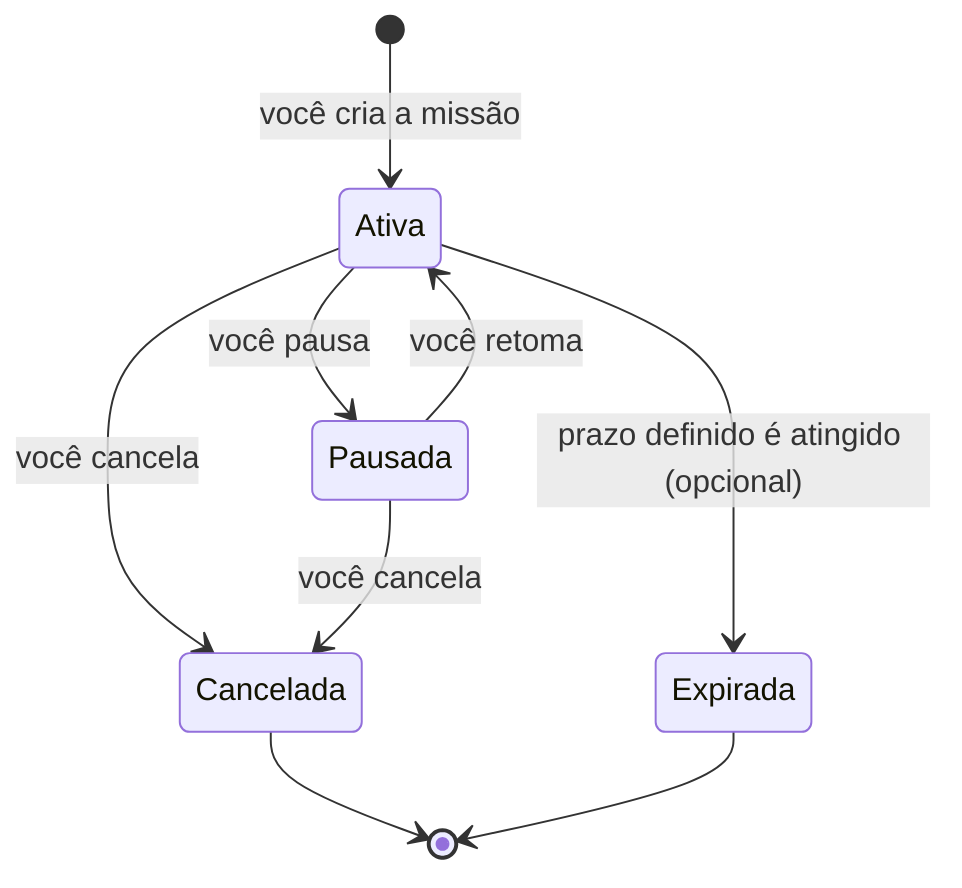

# O que é uma missão

Uma missão é simplesmente um produto que você pediu para o AIShoppingAgent acompanhar. Nada mais complicado que isso — é só o nome que usamos aqui para "aquele pedido que você fez".

Alguns exemplos de como uma missão se parece:

-   **Missão 1**

    SSD NVMe 2 TB
    Quero pagar até R$ 700

-   **Missão 2**

    Ryzen 7 5700X3D
    Me avise quando encontrar uma boa promoção

Repare que uma missão pode ter um preço-alvo definido (como a primeira) ou não (como a segunda) — nos dois casos, o AIShoppingAgent avisa quando o preço cai em relação ao que já foi visto; o preço-alvo só acrescenta um segundo motivo para avisar.

## O que você pode fazer com uma missão

Você tem controle total, pelo mesmo chat onde ela foi criada:

| Ação | O que acontece |
| --- | --- |
| **Criar** | Você descreve o produto, e uma nova missão começa a ser acompanhada. |
| **Consultar** | Você vê todas as suas missões — ativas, pausadas e canceladas — de uma vez. |
| **Pausar** | O acompanhamento para por um tempo, mas nada do que já foi visto se perde. |
| **Continuar** | Uma missão pausada volta a ser acompanhada de onde parou. |
| **Editar** | Você troca as lojas monitoradas ou o preço-alvo, sem precisar recriar a missão. |
| **Cancelar** | A missão é encerrada de vez e para de ser acompanhada. |

## Os estados de uma missão

Visualmente, é assim que uma missão se move entre esses estados:

- **Ativa** — está sendo acompanhada normalmente; alertas podem chegar a qualquer momento.
- **Pausada** — o acompanhamento para temporariamente, mas o histórico continua guardado; pode ser retomada quando você quiser.
- **Cancelada** — encerrada por você; não volta a ser acompanhada.
- **Expirada** — só existe se você mesmo definiu um prazo para aquela missão. Por padrão, uma missão não tem prazo e continua ativa até você decidir pausar ou cancelar.

Quer ver esse controle em ação? Veja os exemplos em [Telegram](telegram.md).
